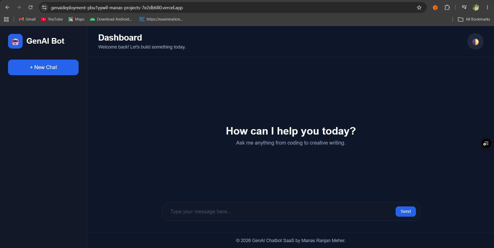
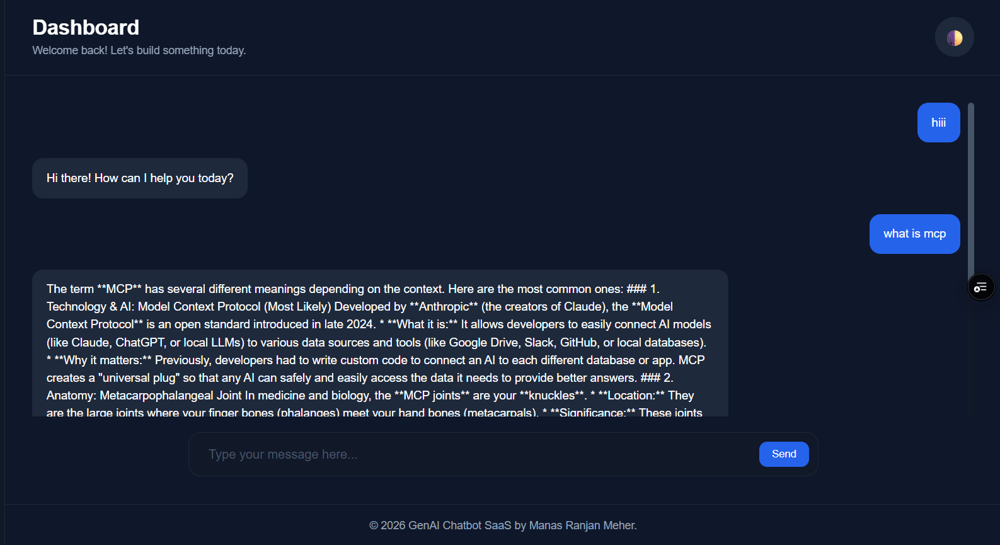
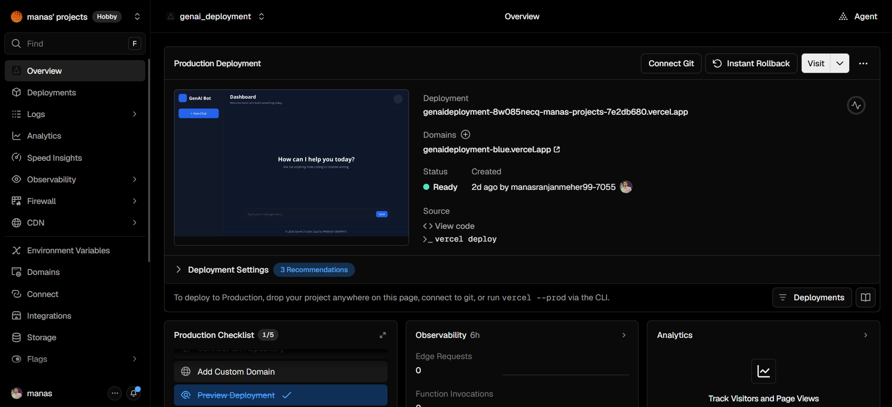

# GenAI Deployment

A Generative AI application structured for deployment with **Vercel**.

This directory contains the complete deployment setup, including the backend, frontend, dependencies, Vercel configuration, and application screenshots.

## 📁 Project Structure

```text
genai_deployment/
│
├── backend/
│   └── ...                         # Backend and API source code
│
├── frontend/
│   └── ...                         # Frontend source code
│
├── screenshots/
│   ├── home.png                   # Application home screen
│   ├── chat.png                   # GenAI chat/interface screen
│   └── deployment.png             # Deployment/application screen
│
├── .gitignore                     # Git ignored files
├── requirements.txt               # Python dependencies
├── vercel.json                    # Vercel deployment configuration
└── README.md                      # Project documentation
```

## 🚀 Overview

The `genai_deployment` project contains a full-stack Generative AI application with separate frontend and backend components.

The project is organized to support local development as well as deployment using **Vercel**.

### Main Components

* **Backend** — Handles backend logic, APIs, and Generative AI functionality.
* **Frontend** — Provides the user interface for interacting with the application.
* **Screenshots** — Contains screenshots demonstrating the application.
* **requirements.txt** — Contains the required Python packages.
* **vercel.json** — Contains the Vercel deployment configuration.
* **.gitignore** — Specifies files and directories that should not be committed to Git.

## 🛠️ Tech Stack

Depending on the implementation, this project may include:

* Python
* Generative AI / LLM APIs
* Frontend web technologies
* REST APIs
* Vercel
* Git & GitHub

## 📂 Backend

The `backend/` directory contains the server-side application and API functionality.

```text
backend/
└── ...
```

Backend responsibilities may include:

* API endpoints
* Generative AI integration
* Request processing
* Response handling
* Backend business logic

## 🎨 Frontend

The `frontend/` directory contains the client-side application.

```text
frontend/
└── ...
```

The frontend is responsible for:

* User interface
* User interaction
* Sending requests to the backend
* Displaying AI-generated responses
* Application presentation

## 🖼️ Screenshots

Screenshots demonstrating the application are stored in the `screenshots/` directory.

### Application



### Chat / GenAI Interface



### Production Deployment




## ⚙️ Installation

### 1. Clone the repository

```bash
git clone https://github.com/manasranjanmeher99/genai_vercel_deployment
cd genai_vercel_deployment/genai_deployment
```

### 2. Install backend dependencies

```bash
pip install -r requirements.txt
```

### 3. Configure environment variables

Create a `.env` or `.env.local` file as required by the application and add the necessary API keys.

Example:

```env
GEMINI_API_KEY=your_api_key_here
```

**Do not commit API keys or other secrets to GitHub.**

## ▶️ Running Locally

Start the backend using the command required by the backend framework.

For example:

```bash
python backend/main.py
```

Start the frontend using the appropriate development command.

The exact commands may vary depending on the frontend and backend frameworks used in the project.

## ☁️ Vercel Deployment

The project includes a `vercel.json` configuration file for Vercel deployment.

Typical deployment workflow:

```text
Local Development
       │
       ▼
   Git Commit
       │
       ▼
 GitHub Repository
       │
       ▼
      Vercel
       │
       ▼
Production Application
```

### Deploy with Vercel

1. Push the project to GitHub.
2. Import the repository into Vercel.
3. Select `genai_deployment` as the project directory if required.
4. Configure the required environment variables.
5. Deploy the application.
6. Verify the production deployment.

## 🔐 Environment Variables

Keep sensitive credentials outside the repository.

Recommended approach:

```text
.env
.env.local
.env.production
```

These files should be included in `.gitignore`.

Use an example file if you want to document required variables:

```text
.env.example
```

without including real API keys.

## 📦 Dependencies

Python dependencies are maintained in:

```text
requirements.txt
```

Install them with:

```bash
pip install -r requirements.txt
```

## 🔄 Deployment Configuration

The `vercel.json` file contains the configuration required by Vercel.

```text
vercel.json
```

Modify this file according to the backend/frontend framework and deployment requirements.

## 📌 Project Purpose

The purpose of this project is to provide a structured and deployment-ready environment for a Generative AI application.

The separation of `backend/` and `frontend/` makes the project easier to:

* Develop
* Maintain
* Test
* Deploy
* Extend

## 👨‍💻 Author

**Manas Ranjan Meher**
